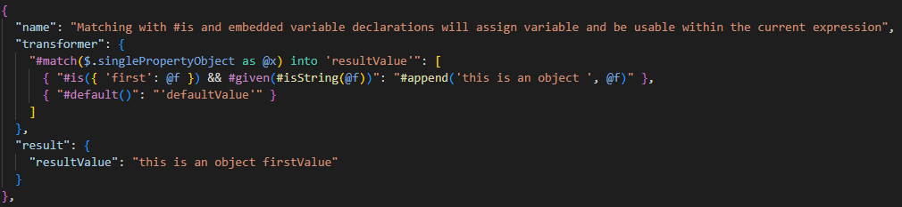
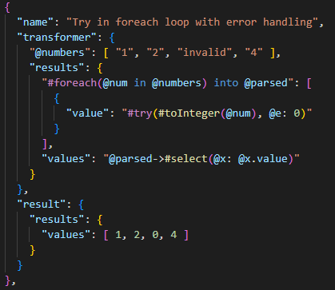
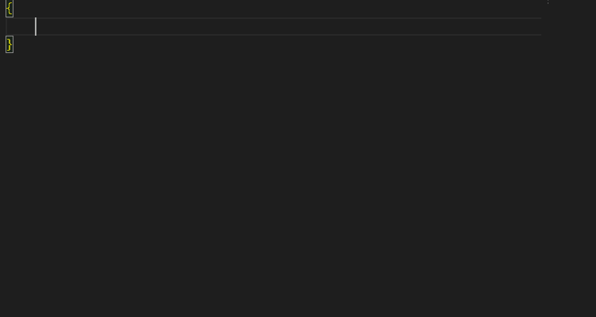
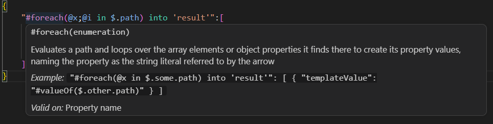
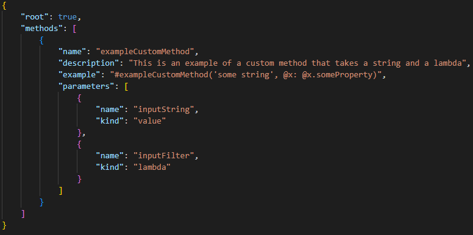
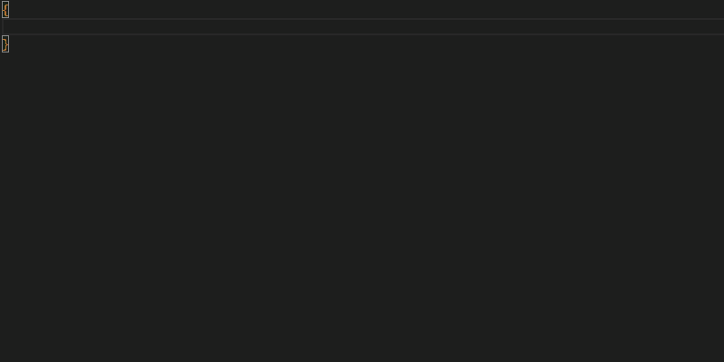

Welcome to the Jolt language extension! This provides syntax coloring, method completion, and variable completion for your Jolt transformers when using the `*.jolt.json` file extension to make reading and managing your transforms a bit easier. The Jolt language interpreter is written in C# and published to NuGet. Please see the project's [GitHub repository](https://github.com/Norhaven/Jolt) for further information and complete documentation.

## Disambiguation

This is _not_ part of the much older and unrelated Java-based JSON transformation library, by coincidence also called Jolt.

## Features

### Syntax Coloring

The Jolt language is embedded inside JSON strings, and editing transforms with the default JSON coloring can make it more difficult to develop and maintain. This language extension provides syntax coloring to make that easier.

### Method & Variable Completion

It can be a bit difficult to know at a glance what the available Jolt Library methods are and their signatures without some help, especially when trying to understand which methods are valid in which areas of your transformer. When you type either a method start symbol `#` or a piped method symbol `->`, you will get a list of available methods with their signatures. Selecting one will provide a snippet to help get you going.

The same holds true for variables and understanding which are currently in scope for you to use and which are not. This extension also provides context-sensitive method and variable completions to help speed up your development and maintenance abilities.

### Method Information On Hover

You may forget what a particular method is for and need a quick refresher on the documented method information. It also slows down your development if you have to continually refer to the README file, so the documented definition for a given method is available when hovering over it.

### Custom Method Completions

Finally, with a little effort you can also have completions and on-hover documentation for your custom methods. In a trusted workspace, this extension will look for a `.jolt` folder containing a `methods.json` file, starting with the current folder containing the transformer and walking back up to either the workspace root or upon finding a `methods.json` file with its `root` property set to true. All `.jolt/methods.json` files collected in this way will be merged into the overall available methods to a given transformer, with files closer to the transformer's folder overriding any previously defined methods higher up the folder hierarchy. Given this behavior, you can then structure your instance-based Jolt context types accordingly to maximize your method selection.

> IMPORTANT: This feature is unavailable in an untrusted workspace to increase security, although the rest of the extension's functionality is allowed. Make sure you are confident that your `methods.json` files are benign prior to establishing workspace trust.

As an example of a `methods.json` file, you could create one that looks like this:

Each method may also include an optional `returnType` property with the method's C# return type (e.g. `"returnType": "OrderSummary"`), which is shown alongside its documentation in completions and on hover. Similarly, a parameter whose `kind` is `lambda` may include an optional `lambdaVariables` array naming the one or two variables it binds (e.g. `"lambdaVariables": ["acc", "current"]` for a `Func<>` with two inputs), which is shown in the method's signature (e.g. `@acc;@current: combiner`) and used for the placeholders when completing it. Lambdas without it are shown with a single `@x` variable.

After creating the file, it would then be accessible to a transformer within that folder or a subfolder, like this:

It's also important to note that any updates to the `methods.json` file will only be picked up when by this extension when the file is saved. Unsaved definitions will not be loaded. Additionally, transformers opened from outside the workspace will only check their own folder and that file isn't watched for changes, meaning that any changes there will need to reload the VSCode window to be applied. As a last caveat, any custom methods whose name collides with a defined Jolt standard library method will be ignored (as per Jolt's execution rules) and will not be available in your transformer completions or on-hover behavior.

## Requirements

There are no additional requirements or dependencies at the moment aside from naming your transformer files appropriately, using a supported theme, and using Jolt!

## Extension Settings

This extension offers default colorization settings via the `editor.tokenColorCustomizations` setting. This supports the following themes:
* **Dark Mode** (via `Dark 2026`, `Default Dark Modern`, `Default Dark+`, or `Visual Studio Dark`)
* **Light Mode** (via `Light 2026`, `Default Light Modern`, `Default Light+`, or `Visual Studio Light`)

## Roadmap

We're considering several features, including:
- Providing syntax validations
- Raising semantic issues

## Release Notes

### 1.3.0

Targeted release for method return types. This includes:
- Optional custom method return types (in `.jolt/methods.json` files)
- On-Hover documentation for C# return types

### 1.2.0

Targeted release for custom method support. This includes:
- Custom method definition files (i.e. `.jolt/methods.json`)
- Code completion support for custom methods in these files
- On-Hover documentation for custom methods

### 1.1.0

Followup release of the Jolt language extension. This includes:
- Method completions
- Variable completions
- On-Hover documentation

### 1.0.0

Initial release of the Jolt language extension. This includes:
- Language syntax colorization within `*.jolt.json` files.

---

## For more information

* Please visit the [Jolt GitHub page](https://github.com/Norhaven/Jolt) for complete documentation on the Jolt language.